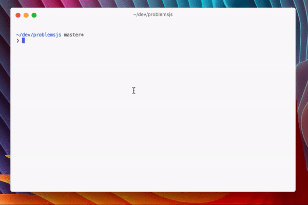

# Problems.js
**The hackable problems viewer**



*Problems.js* automatically executes development related tasks and displays resulting problems in a nice CLI.


| 😱 | *Problems.js* in a Nutshell |
| :------------- |:-------------|
| ✅ | **Flexible:** Executes *arbitrary* tasks, parses the output and displays the result in a CLI. |
| ✅ | **Easy to get started:** `problemsjs init && problemsjs view`. Done. |
| ✅ | **Interactive Problems View:** Use the arrow keys to jump between found problems. Use ⏎ to open the selected problem in your favorit editor. |
| ✅ | **Watches you constantly:** *Problems.js* watches your code for changes and reruns your tasks to find new problems. |

## Installation
Via npm:

```
$ npm install --global problemsjs
```

## Using *Problems.js*
Run *Problems.js* from the command line by passing it a configuration file:

```
$ problemsjs --config path/to/pv-config.json
```

The default value for `--config` is `.problemsjs.config.json`.

Assuming `path/to/pv-config.json` contains a valid *Problems.js* configuration the following things will happen:

- The configured tasks are executed.
- Any reported problems are displayed in the terminal.
- Relevant files are watched for changes.
- On each change the tasks are executed again.

You can use the ⬆︎ and ⬇︎ keys to navigate between displayed problems. Use ⏎ to open the selected problem.

Before you can actually run *Problems.js* you have to configure it.

## Configuration
Before *Problems.js* any do anything meaningful it has to be configured. You do so by creating a configuration file:(preferably in the root directory of your project):

```
$ problemsjs init
```

This creates a default configuration file (`.problemsjs.config.json`). You should be able to run *Problems.js* like this:

```
$ problemsjs view
```

The command above starts *Problems.js* (using the configuration file you just created) and display a few sample problems.

### Example Configurations
You can have as many tasks as you want.

#### Testing with Jest

```
{
  "tasks": [{
    "name": "test",
    "matcher": "jest",
    "program": "jest",
    "args": [
       "--rootDir",
       "${workspaceFolder}",
       "--config",
       "${workspaceFolder}/jest.config.js",
       "--json",
       "--silent",
       "--reporters",
       "--all"
    ]
  }]
}
```

#### Type Checking with Flow
```
{
  "tasks": [{
    "name": "flow",
    "matcher": "flow",
    "program": "flow",
    "args": [
      "check",
      "--json",
      "--pretty",
      "${workspaceFolder}"
    ]
  }]
}
```

#### Linting with ESLint
```
{
  "tasks": [{
    "name": "lint",
    "matcher": "eslint",
    "program": "eslint",
    "args": [
      "${workspaceFolder}",
      "--config",
      "${workspaceFolder}/.eslintrc.js",
      "--ext",
      ".js,.json",
      "--format=json"
    ]
  }]
}
```

### File Format

| Property | Type | Description |
|:--|:--|:--|
|`openInEditorCommand` | `string` | Command to be executed when hitting ⏎ in the *Problems.js* CLI app. You should definitely [read the detailed documentation about this property](#property-openineditorcommand) if you want to use this feature. |
| `watcherOptions` | [WatcherOptions](#configuration-watcheroptions) | Specifies which files should be watched for changes. |
| `tasks` | [Array of Tasks](#configuration-tasks) | Specifies the tasks that should be executed automatically when a watched file is modified. |

**Important**

You can use `${workspaceFolder}` anywhere in the configuration file. `${workspaceFolder}` will be substituted by the root folder of your project/workspace. *Problems.js* is using the folder of your configuration file as the `${workspaceFolder}`.

#### Property: openInEditorCommand
You can use the following variables in your `openInEditorCommand`-string:

| Variable | Type | Description | Example Value |
|:--|:--|:--|:--|
| `absolutePath` | `string` | Absolute path to the currently selected problem. | `/Users/chris/test/file.js` |
| `line` | `number` | Line number of the currently selected problem. | `123` (defaults to `1`) |

**Example: Open Problem in Visual Studio Code**

```
{
…
  "openInEditorCommand": "code --goto ${absolutePath}:${line}",
…
}
```

You refer to variables by using the well known `${varname}`-syntax. `${line}` is always present (even if the line number is unknown to *Problems.js* or if the problem concerns the whole file. In that case `${line}` will simply be `1` – to make life easier.

#### Property: watcherOptions
At the moment there is only a single property that can be specified by `watcherOptions`.

| Variable | Type | Description | Example Value |
|:--|:--|:--|:--|
| `watchedFolder` | `string` | Absolute path to the root folder whose files should be watched for changes. | `/Users/chris/test/` |
| `includes` | `Array of strings`; optional | Specifies which files should be watched. An array of globs. By default all JavaScript files are watched. | `['**/*.css', '**/*.html']` |

**Implementation Detail**

Internally [Chokidar](https://github.com/paulmillr/chokidar) is used to watch for changes. The specified folder passed as is, without further configuration, to Chokidar. This means that Chokidar defaults apply when it comes to detecting changes. In my tests it worked good enough.

#### Property: tasks
A single task has the following properties:

| Property | Type | Description |
|:--|:--|:--|
|`name` | `string` | Name of the task. Will be used in the CLI UI to allow differentiation of problems. |
|`cwd` | `string` (optional) | Current working directory used when executing the task. Defaults to the current working directory (`process.cwd()`). |
|`program` | `string` | The program (without any arguments) to be executed by *Problems.js*. |
|`matcher` | `string` | Specifies the matcher used to transform the task output to a set of problems. Available matchers: `jest`, `eslint`, `line`, `tslint` and `flow`. |
|`args` | `Array of strings` | Arguments passed to the `program`. |

## Command Line
```
problemsjs --help
problemsjs <command>

Commands:
  problemsjs init  Creates a new Problem.js configuration file in the
                   current directory
  problemsjs view  Displays problems and continiously checks for new
                   problems.

Options:
  --version  Show version number
  --help     Show help
```

## Matcher
Each task must be associated with a *matcher*.  A matcher is responsible for turning the output of a task into something that *Problems.js* understands. *Problems.js* comes with several matchers that you can use out of the box.

### Matcher: eslint
Turns the JSON-output from ESLint into problems.

**Example**

```
eslint ${workspaceFolder} --config ${workspaceFolder}/.eslintrc.js --ext .js,.json --format=json
```

### Matcher: tslint
Turns the JSON-output from TSLint into problems.


**Example**

```
tslint --config ${workspaceFolder}/tslint.json --project ${workspaceFolder} -t json
```

### Matcher: flow
Turns the JSON-output from flow into problems.


**Example**

```
flow check --json --pretty ${workspaceFolder}
```

### Matcher: jest
Turns the JSON-output from jest into problems. In addition a summary is also displayed in the status bar.

**Example**

```
jest --rootDir ${workspaceFolder} --config ${workspaceFolder}/jest.config.js --json --silent --reporters --all
```

### Matcher: line
Turns each line of text into a problem.

**Example**

```
echo "first problem\nsecond problem"
```

You can use this matcher to integrate with other tools that are not supported by default.

## Hacking *Problems.js*

**⚠️ ⚠️ DANGER ZONE ⚠️ ⚠️**

The *API* is not yet stable at all. The following example is simply trying to convey the current state of the *API*.

**⚠️ ⚠️ DANGER ZONE ⚠️ ⚠️**

You can configure *Problems.js* even more by using the *API* directly. A short summary of what is possible:

* Write and register custom matchers.
* Add custom things to the status bar.
* Modify the configuration at runtime.
* Intercept and modify the most important events.

The following example shows most of what is already possible:

```javascript
// @flow
'use strict';

const { App, CLI } = require('problemsjs');

const watcherOptions = {
  watchedFolder: process.cwd()
};

const config = { watcherOptions, tasks: [] };

const cli = new CLI();
const app = new App({ config });

app.delegate = cli;

// Register a custom Matcher here:
app.useMatcher('no_problems', (input) => {
  return { problems: [] };
});

app.start(() => {});
```

- This example first imports `App` and `CLI` - the two main building blocks.
- Then a configuration is created which will execute no tasks (`tasks: []`) and simply watch the current directory.
- After that, `app` and `cli` are created and hooked up (`app.delegage = cli;`).
- `app` emits several events which are simply piped directly to the `cli`-instance.
- The second to last step is the creation and registration of a new matcher.
- The matcher is simply always returning an empty `problems`-array. This means that this matcher will never produce any meaningful problems. However, it shows the basics.
- Then everything is started.

If you execute the code above `node yourfile.js`, you will see an empty problems view.